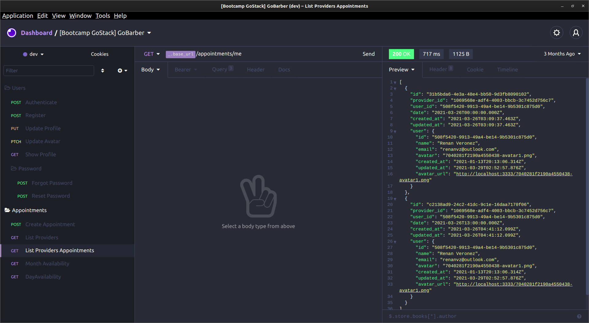

<h1 align="center">
    
</h1>

# 🚀 Bootcamp GoStack

# 
 Node Server GoBarber 

### 
Status: Ambiente de Testes (localhost:3000) 🟠 

 

 

## 🧪 Tecnologias

São utilizadas as seguintes tecnologias:

- [Node](https://nodejs.org/en/)
- [Typescript](https://www.typescriptlang.org/)
- [MongoDB](https://www.mongodb.com/)
- [PostgresSQL](https://www.postgresql.org/)
- [Redis](https://redis.io/)
- [Docker](https://www.docker.com/)

## 🚀 Como executar

- Clone o repositório
- Instale as dependências com `yarn`
- Inicie Redis, MongoDB e PostgresSQL `sudo docker start ____`
- Inicie o servidor com `yarn dev:server`

Servidor em [`localhost:3333`](http://localhost:3333) do seu navegador.

## 💻 Projeto

Este projeto tem o objetivo de ser utilizado como servidor para o GoBarber app, que pode ser clonado [aqui](https://github.com/renanvzd/06-gobarberweb)

# FUNCIONALIDADES:

# Recuperação de senha

**Requisitos Funcionais**

- O usuário deve poder recuperar sua senha informando o seu e-mail;
- O usuário deve receber um e-mail com instruções de recuperação de senha;
- O usuário deve poder resetar sua senha;
  * Identificar o usuário

**Requisitos Não Funcionais**

- Utilizar Mailtrap para testar envios em ambiente de dev;
- Utilizar Amazon SES para envios em produção;
- O envio de e-mails deve acontecer em segundo plano (background job);

**Regra de Negócio**

- O link enviado por e-mail para resetar senha, deve expirar em 2h;
- O usuário precisa confirmar a nova senha ao resetar sua senha;

** Reset de Senha
1. Rotas e Controllers
2. Repositório de tokens (TypeORM)
3. Criar migration de tokens
4. Provider de envio de e-mail (DEV)
5. Registrar providers no container
6. Testar tudo!

# Atualização do Perfil

**Requisitos Funcionais**
- O usuário deve poder atualizar seu nome, email e senha;

**Requisitos Não Funcionais**
- Não tem

**Regra de Negócio**
- O usuário não pode alterar seu email para um email já utilizado;
- Para atualizar sua senha, o usuário deve informar a senha antiga;
- Para atualizar sua senha, o usuário precisa confirmar a nova senha;

# Painel do prestador

**Requisitos Funcionais**

- O usuário deve poder listar seus agendamentos de um dia específico;
- O prestador deve receber uma notificação sempre que houver um novo agendamento;
- O prestador deve poder visualizar as notificações não lidas;

**Requisitos Não Funcionais**

- Os agendamentos do prestador no dia devem ser armazenados em cache;
- As notificações do prestador devem ser armazenados no MongoDB;
- As notificações do prestador devem ser enviadas em tempo-real utilizando Socket.io;

**Regra de Negócio**

- A notificação deve ter um status de lida ou não lida para que o prestador possa controlar;

# Agendamento de Serviços

**Requisitos Funcionais**

- O usuário deve poder listar todos prestadores de serviço cadastrados;
- O usuário deve poder listar os dias de um mês com pelo menos um horário disponível de um prestador;
- O usuário deve poder listar horários disponíveis em um dia específico de um prestador;
- O usuário deve poder realizar um novo agendamento com um prestador;

**Requisitos Não Funcionais**

- A listagem de prestadores deve ser armazenada em cache;

**Regra de Negócio**

- Cada agendamento deve durar 1h exatamente;
- Os agendamentos devem estar disponíveis entre 8h às 18h (Primeiro às 8h, último às 17h);
- O usuário não pode agendar em um horário já ocupado;
- O usuário não pode agendar em um horário que já passou;
- O usuário não pode agendar serviços consigo mesmo;

<h1 align="center">
  
</h1>

---

Copyright: [Rocketseat Bootcamp](https://github.com/rocketseat-education/bootcamp-gostack-modulos)